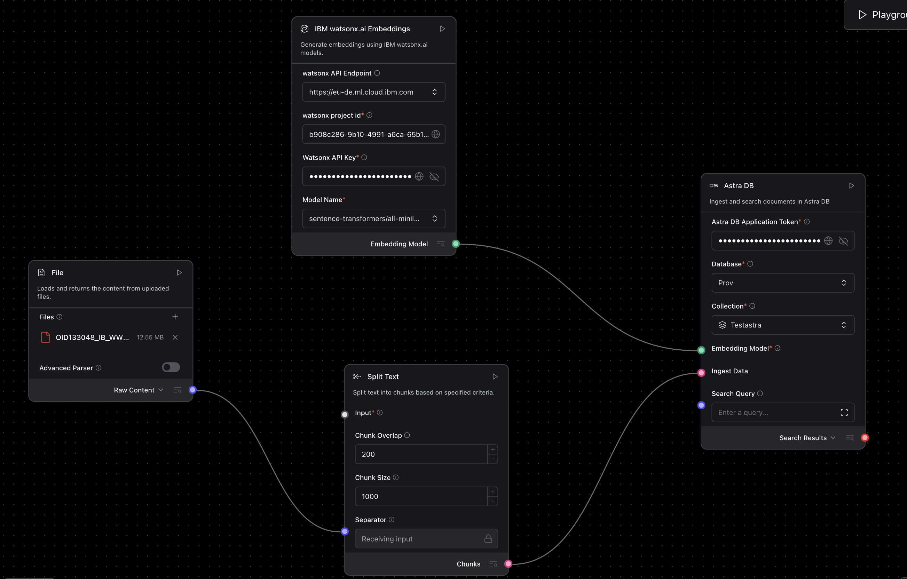
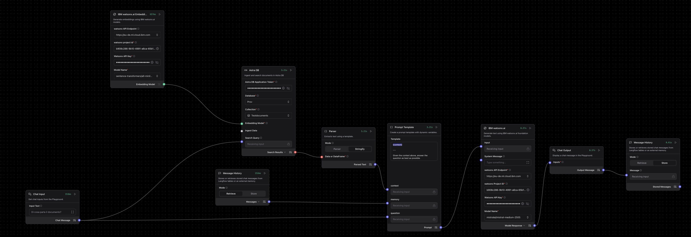
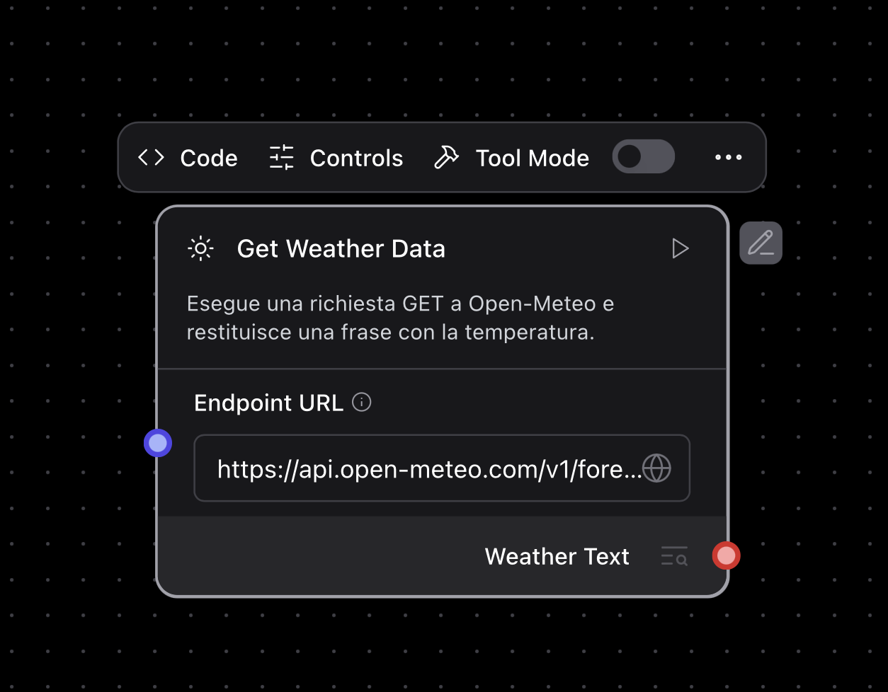

# Guida Completa: Sistema RAG con Langflow e AstraDB
## Da Zero a Hero - Hackathon Edition

Questa guida ti accompagnerà passo dopo passo nella creazione di un sistema RAG (Retrieval-Augmented Generation) completo utilizzando Langflow e AstraDB di DataStax.

---

## 📋 Indice

1. [Installazione Langflow Desktop](#1-installazione-langflow-desktop)
2. [Setup Iniziale: Creazione Database AstraDB](#2-setup-iniziale-creazione-database-astradb)
3. [Sezione 1: Data Ingestion - Caricamento Documenti](#3-sezione-1-data-ingestion---caricamento-documenti)
4. [Sezione 2: Chat Interface - Sistema di Ricerca e Risposta](#4-sezione-2-chat-interface---sistema-di-ricerca-e-risposta)
5. [Sezione 3: Custom Component - Creazione Componente Personalizzato](#5-sezione-3-custom-component---creazione-componente-personalizzato)

---

## 1. Installazione Langflow Desktop

Prima di iniziare a costruire il tuo sistema RAG, devi installare Langflow Desktop sul tuo computer.

### 1.1 Download e Installazione

1. **Vai su [langflow.org/desktop](https://www.langflow.org/desktop)**
2. **Scarica la versione** appropriata per il tuo sistema operativo:
   - **Windows**: File `.exe`
   - **macOS**: File `.dmg`
   - **Linux**: File `.AppImage` o `.deb`

3. **Installa l'applicazione**:
   - **Windows**: Esegui il file `.exe` e segui la procedura guidata
   - **macOS**: Apri il file `.dmg` e trascina Langflow nella cartella Applicazioni
   - **Linux**: Rendi eseguibile il file `.AppImage` o installa il pacchetto `.deb`

### 1.2 Primo Avvio

1. **Avvia Langflow Desktop** dal menu applicazioni
2. **Attendi** che l'applicazione si avvii (potrebbero volerci alcuni secondi al primo avvio)
3. Sei pronto per iniziare a creare i tuoi flussi!


## 2. Setup Iniziale: Creazione Database AstraDB

### 2.1 Registrazione su AstraDB

1. **Vai su [astra.datastax.com](https://astra.datastax.com)**
2. **Clicca su "Sign in with Google"** per accedere con il tuo account Google
3. Una volta effettuato l'accesso, verrai reindirizzato alla dashboard di AstraDB

### 2.2 Creazione del Database

1. **Dalla dashboard, clicca su "Create Database"**
2. **Compila i seguenti campi:**
   - **Database name**: `Test` (o un nome a tua scelta)
   - **Cloud Provider**: Scegli `Amazon Web Services`
   - **Region**: Scegli `us-east-2`

3. **Clicca su "Create Database"**
   - ⏱️ La creazione richiede alcuni minuti (3-5 minuti circa)
   - Vedrai lo stato "Pending" che diventerà "Active" quando pronto

### 2.3 Creazione della Collection

Una volta che il database è attivo:

1. **Vai alla sezione "Data Explorer"**
2. **Clicca su "Create Collection"**
3. **Configura la collection:**
   - **Collection name**: `test_rag` (o un nome a tua scelta)
   - **Embedding generation method**: 
     - Scegli `Bring your own` (useremo un modello di embedding esterno su watsonx.ai)
   - **Dimensions**: `384` (dipende dal modello di embedding che userai)
     - Per IBM Watsonx sentence-transformers/all-minilm-l6-v2 embeddings: `384`

4. **Clicca su "Create Collection"**

### 2.4 Ottenere le Credenziali

1. **Vai su "Settings" → "Tokens"**
2. **Seleziona il ruolo**: `Organization Administrator`
3. **Clicca su "Generate Token"**
4. **Copia e salva in modo sicuro:**
   - `Token` (inizia con `AstraCS:...`)

⚠️ **IMPORTANTE**: Salva queste credenziali in un posto sicuro, ti serviranno per configurare Langflow!

---

## 3. Sezione 1: Data Ingestion - Caricamento Documenti

Questa sezione crea il flusso per caricare documenti nel database vettoriale AstraDB.

⚠️ **IMPORTANTE**: Questo Flusso va eseguito solo la prima volta per caricare i dati dei File su cui fare RAG sul db

### 3.1 Componenti Necessari

Il flusso di Data Ingestion è composto da 4 componenti principali:

```
File → SplitText → AstraDB (Ingestion) → WatsonxEmbeddings
```



### 3.2 Componente 1: File Input

**Scopo**: Carica il file da cui estrarre i dati

**Configurazione:**

1. **Aggiungi il componente " Read File"** dalla palette `Files`
2. **Parametri principali:**
   - **Select File**: Qui caricherai il tuo documento (PDF, TXT, MD, DOCX, etc.)

**Output**: `Message` contenente il testo estratto dal file

**Cosa fa**: 
- Legge il contenuto del file caricato
- Supporta vari formati: PDF, TXT, etc.
- Estrae il testo e lo passa al componente successivo

### 3.3 Componente 2: Split Text

**Scopo**: Divide il testo in chunk più piccoli per una migliore indicizzazione

**Configurazione:**

1. **Aggiungi il componente "Split Text"** dalla palette `Processing`
2. **Connetti** l'output `message` di `File` all'input `data_inputs` di `SplitText`
3. **Parametri principali:**
   - **Chunk Size**: `1000` (numero di caratteri per chunk)
   - **Chunk Overlap**: `200` (sovrapposizione tra chunk per mantenere contesto)

**Output**: `DataFrame` contenente i chunk di testo

**Cosa fa**:
- Prende il testo lungo dal file
- Lo divide in pezzi più piccoli (chunks) di dimensione gestibile
- Mantiene una sovrapposizione tra chunks per non perdere contesto
- Ogni chunk diventerà un documento separato nel database

**Perché è importante**:
- I modelli di embedding hanno limiti di token
- Chunks più piccoli permettono ricerche più precise
- La sovrapposizione evita di perdere informazioni ai confini

### 3.4 Componente 3: Watsonx Embeddings (per Ingestion)

**Scopo**: Genera gli embeddings vettoriali per i chunk di testo

**Configurazione:**

1. **Aggiungi il componente "Watsonx Embeddings"** dalla palette, cerca il bundle `IBM` e seleziona `IBM watsonx.ai Embeddings`
2. **Parametri principali:**
   - **API Key**: La tua chiave API IBM Watsonx
   - **Project ID**: Il tuo Project ID Watsonx
   - **Model**: `sentence-transformers/all-minilm-l6-v2` (o altro modello di embedding)
   - **URL**: `https://eu-de.ml.cloud.ibm.com` (o la tua region)

**Output**: `Embeddings` (modello di embedding configurato)

**Cosa fa**:
- Configura il modello di embedding IBM Watsonx
- Questo modello trasformerà il testo in vettori numerici
- I vettori catturano il significato semantico del testo

### 3.5 Componente 4: AstraDB

**Scopo**: Salva i chunk e i loro embeddings nel database vettoriale

**Configurazione:**

1. **Aggiungi il componente "Astra DB"** cercando nella palette
2. **Connetti:**
   - Output `dataframe` di `SplitText` → Input `ingest_data` di `AstraDB`
   - Output `embeddings` di `WatsonxEmbeddings` → Input `embedding_model` di `AstraDB`

3. **Parametri di Connessione:**
   - **Token**: Il token AstraDB che hai salvato (formato: `AstraCS:...`)
   - **API Endpoint**: L'endpoint del tuo database
   - **Database Name**: `test` (o il nome che hai scelto)
   - **Collection Name**: `test_rag` (o il nome della tua collection)

**Cosa fa**:
1. Riceve i chunk di testo dal `SplitText`
2. Per ogni chunk, usa il modello di embedding per generare un vettore
3. Salva nel database AstraDB:
   - Il testo del chunk (campo `page_content`)
   - Il vettore di embedding
   - Eventuali metadati (fonte, pagina, etc.)
4. Crea un indice vettoriale per ricerche veloci

**Processo di Ingestion**:
```
Chunk 1 → Embedding → [0.123, 0.456, ...] → AstraDB
Chunk 2 → Embedding → [0.789, 0.012, ...] → AstraDB
Chunk 3 → Embedding → [0.345, 0.678, ...] → AstraDB
...
```

### 3.6 Esecuzione del Flusso di Ingestion

1. **Carica un file** nel componente `File`
2. **Clicca sul pulsante "Run"** del componente `AstraDB`
3. **Attendi il completamento** (vedrai il numero di documenti inseriti)
4. **Verifica** nella console di AstraDB che i documenti siano stati caricati

---

## 4. Sezione 2: Chat Interface - Sistema di Ricerca e Risposta

Questa sezione crea l'interfaccia di chat che permette di fare domande sui documenti caricati.

### 4.1 Architettura del Flusso Chat

```
ChatInput → [AstraDB Search] → Parser → Prompt → LLM → ChatOutput
              ↓
         WatsonxEmbeddings
```



### 4.2 Componente 1: Chat Input

**Scopo**: Riceve la domanda dell'utente

**Configurazione:**

1. **Aggiungi il componente "Chat Input"** dalla palette `Input & Output`
2. **Parametri:**
   - **Input Text**: `What is this document about?` (testo di esempio)

**Cosa fa**:
- Cattura l'input dell'utente dalla chat UI
- Gestisce la cronologia della conversazione
- Passa la domanda ai componenti successivi

### 4.3 Componente 2: Watsonx Embeddings (per Search)

**Scopo**: Genera l'embedding della domanda per la ricerca semantica

**Configurazione:**

1. **Aggiungi un SECONDO componente "Watsonx Embeddings"** (separato da quello di ingestion)
2. **Usa le stesse configurazioni** del primo:
   - **API Key**: La tua chiave API IBM Watsonx
   - **Project ID**: Il tuo Project ID Watsonx
   - **Model**: `sentence-transformers/all-minilm-l6-v2` (STESSO modello dell'ingestion!)
   - **URL**: `https://eu-de.ml.cloud.ibm.com`

**⚠️ IMPORTANTE**: Devi usare lo STESSO modello di embedding usato per l'ingestion!

**Cosa fa**:
- Trasforma la domanda dell'utente in un vettore
- Questo vettore sarà usato per trovare i chunk più simili nel database

### 4.4 Componente 3: AstraDB

**Scopo**: Cerca i documenti più rilevanti nel database

**Configurazione:**

1. **Aggiungi un SECONDO componente "Astra DB"** (separato da quello di ingestion)
2. **Connetti:**
   - Output `message` di `ChatInput` → Input `search_query` di `AstraDB`
   - Output `embeddings` di `WatsonxEmbeddings` (search) → Input `embedding_model` di `AstraDB`

3. **Parametri di Connessione** (stessi dell'ingestion):
   - **Token**: Il tuo token AstraDB
   - **Database Name**: `test`
   - **Collection Name**: `test_rag`


**Output**: `Data` contenente i chunk più rilevanti trovati

**Cosa fa**:
1. Riceve la domanda dell'utente (già convertita in embedding)
2. Esegue una ricerca vettoriale nel database:
   ```
   Query: "What is this document about?"
   Query Embedding: [0.234, 0.567, ...]
   
   Cerca nel DB i vettori più simili:
   Chunk 1: Similarity = 0.92 ✓
   Chunk 2: Similarity = 0.88 ✓
   Chunk 3: Similarity = 0.85 ✓
   Chunk 4: Similarity = 0.82 ✓
   ```
3. Restituisce i top-K chunk più rilevanti (default: 4)

### 4.5 Componente 4: Parser

**Scopo**: Converte i risultati della ricerca in testo leggibile

**Configurazione:**

1. **Aggiungi il componente "Parser"** dalla palette `Processing`
2. **Connetti** l'output `search_results` di `AstraDB` all'input `input_data` di `Parser`
3. **Parametri:**
   - **Mode**: `Stringify` (converte in stringa semplice)

**Output**: `Message` contenente il testo formattato dei chunk trovati

**Cosa fa**:
- Prende i risultati della ricerca (oggetti Data)
- Li converte in testo leggibile
- Rimuove formattazioni non necessarie
- Concatena i chunk con separatori

**Esempio di Output**:
```
Chunk 1: Il documento parla di intelligenza artificiale...
Chunk 2: I sistemi RAG combinano retrieval e generation...
Chunk 3: AstraDB è un database vettoriale distribuito...
Chunk 4: Langflow permette di creare flussi visualmente...
```

### 4.6 Componente 5: Prompt

**Scopo**: Crea il prompt per il modello LLM combinando domanda e contesto

**Configurazione:**

1. **Aggiungi il componente "Prompt Template"** dalla palette `Models & Agents`

2. **Template del Prompt:**

Per esempio scrivi nel template del prompt:
```
{context}

---

Given the context above, answer the question as best as possible.

History:

{memory}

Question: {question}

Answer: 
```
3. **Connetti:**
   - Output `message` di `ChatInput` → Input `question` di `Prompt`
   - Output `parsed_text` di `Parser` → Input `context` di `Prompt`


**Output**: `Message` contenente il prompt completo

**Cosa fa**:
- Combina la domanda dell'utente con il contesto recuperato
- Crea un prompt strutturato per il LLM
- Istruisce il modello su come rispondere

**Esempio di Prompt Generato**:
```
You are a helpful assistant. Answer the user's question based on the context provided.

Context:
Il documento parla di intelligenza artificiale e sistemi RAG.
I sistemi RAG combinano retrieval e generation per risposte accurate.
AstraDB è un database vettoriale distribuito basato su Apache Cassandra.
Langflow permette di creare flussi AI visualmente senza codice.

Question: What is this document about?

Answer:
```

**Best Practices per il Prompt**:
- Sii chiaro nelle istruzioni
- Specifica il formato della risposta desiderato
- Includi esempi se necessario

### 4.7 Componente 6: IBM Watsonx Model (LLM)

**Scopo**: Genera la risposta finale usando un Large Language Model

**Configurazione:**

1. **Aggiungi il componente "IBM watsonx.ai"** dalla palette (cerca il bundle `IBM` e seleziona `IBM watsonx.ai`)
2. **Connetti** l'output `prompt` di `Prompt` all'input `input` di `IBM watsonx.ai`
3. **Parametri:**
   - **API Key**: La tua chiave API IBM Watsonx
   - **Project ID**: Il tuo Project ID Watsonx
   - **Model**: `mistralai/mistral-medium-2505` (o altro modello generativo)
   - **watsonx API endpoint**: `https://eu-de.ml.cloud.ibm.com`

**Output**: `Message` contenente la risposta generata

**Cosa fa**:
1. Riceve il prompt completo (domanda + contesto)
2. Invia la richiesta al modello LLM di IBM Watsonx
3. Il modello genera una risposta basata sul contesto fornito
4. Restituisce la risposta come messaggio

### 4.8 Componente 7: Chat Output

**Scopo**: Mostra la risposta all'utente nell'interfaccia chat

**Configurazione:**

1. **Aggiungi il componente "Chat Output"** dalla palette `Input & Output`
2. **Connetti** l'output `text_output` di `IBM watsonx.ai` all'input `input_value` di `ChatOutput`
3. **Parametri:**
   - **Store Messages**: `True` (salva nella cronologia)
   - **Sender**: `Machine`
   - **Sender Name**: `AI`

**Output**: `Message` visualizzato nella chat UI

**Cosa fa**:
- Riceve la risposta generata dal LLM
- La visualizza nell'interfaccia chat di Langflow
- Salva il messaggio nella cronologia della conversazione
- Permette all'utente di continuare la conversazione

### 4.9 Componente 8: Message History (Modalità Retrieve)
Scopo: Recupera i messaggi precedenti per fornire la memoria della conversazione al modello.

**Configurazione:**

Aggiungi il componente "Message History" dalla palette e collega l'output all'input Memory del componente prompt template

**Parametri**:

Mode: Seleziona Retrieve.

Output: Message (o testo) contenente lo storico della chat recuperato.

**Cosa fa**:

Si interfaccia con il database di Langflow per richiamare i messaggi passati della sessione in corso.

Restituisce la cronologia in formato leggibile, predisponendola per essere eventualmente passata come input (es. {memory}) al componente "Prompt".

### 4.10 Componente 9: Message History (Modalità Store)
Scopo: Salva le nuove risposte generate dall'AI all'interno della memoria della conversazione.

**Configurazione:**

Aggiungi un SECONDO componente "Message History" dalla palette.

Connetti:

Output del Chat Output → Input Message di Message History.

Parametri:

Mode: Seleziona Store.

**Cosa fa:**

Prende la risposta finale appena fornita al Chat Output.

La archivia in modo persistente nel database di Langflow, garantendo che il componente "Retrieve" (Componente 8) possa pescarla al turno successivo di chat.

### 4.11 Flusso Completo della Chat

**Sequenza di Esecuzione**:

1. **Utente**: "What is this document about?"
2. **ChatInput**: Cattura la domanda
3. **WatsonxEmbeddings**: Converte domanda in vettore `[0.234, 0.567, ...]`
4. **AstraDB Search**: Trova i 4 chunk più simili nel database
5. **Parser**: Converte i chunk in testo leggibile
6. **Prompt**: Crea il prompt combinando domanda + contesto
7. **IBMwatsonxModel**: Genera la risposta basata sul prompt
8. **ChatOutput**: Mostra la risposta all'utente

**Esempio di Conversazione**:
```
User: What is this document about?

AI: Based on the provided context, this document discusses 
Retrieval-Augmented Generation (RAG) systems and how to build 
them using Langflow and AstraDB. It covers data ingestion, 
vector search, and creating chat interfaces for question-answering 
over documents.

User: How does vector search work?

AI: Vector search works by converting text into numerical 
representations called embeddings. When you ask a question, 
it's also converted to an embedding, and the system finds 
documents with similar embeddings using mathematical similarity 
measures like cosine similarity...
```

### 4.12 Testing del Sistema Chat

1. **Apri il Playground** di Langflow
2. **Fai una domanda** nella chat

---

## 5. Sezione 3: Custom Component - Creazione Componente Personalizzato

In questa sezione imparerai a creare un componente personalizzato generico che puoi riutilizzare nei tuoi flussi.

### 5.1 Cos'è un Custom Component?

Un Custom Component è un blocco di codice Python che puoi creare per:
- Aggiungere funzionalità non disponibili nei componenti standard
- Integrare API esterne
- Implementare logica di business personalizzata
- Processare dati in modi specifici

### 5.2 Struttura Base di un Custom Component

```python
from langflow.custom import Component
from langflow.io import MessageTextInput, Output
from langflow.schema.message import Message


class MyCustomComponent(Component):
    display_name = "My Custom Component"
    description = "Description of what this component does"
    icon = "icon-name"
    
    inputs = [
        MessageTextInput(
            name="input_text",
            display_name="Input Text",
            info="Text to process",
        ),
    ]
    
    outputs = [
        Output(
            display_name="Output",
            name="output",
            method="process_text",
        ),
    ]
    
    def process_text(self) -> Message:
        # Your custom logic here
        result = self.input_text.upper()
        return Message(text=result)
```

### 5.3 Esempio Pratico: Weather Component

Creiamo un componente che recupera i dati meteo da un'API pubblica (Open-Meteo). Clicca su New Custom Component in basso a sinistra.
Seleziona il Custom Component appena creato e clicca su `Code` per scriverne il codice
**Scopo**: Questo componente dimostra come:
- Chiamare un'API REST esterna
- Processare la risposta JSON
- Gestire errori di rete
- Restituire dati formattati



**Codice Completo**:

```python
import requests
from lfx.custom.custom_component.component import Component
from lfx.io import MessageTextInput, Output
from lfx.schema.data import Data


class WeatherHttpGetComponent(Component):
    display_name = "Get Weather Data"
    description = "Esegue una richiesta GET a Open-Meteo e restituisce una frase con la temperatura."
    documentation: str = "https://docs.langflow.org/components-custom-components"
    icon = "sun"
    name = "WeatherHttpGetComponent"

    inputs = [
        MessageTextInput(
            name="endpoint_url",
            display_name="Endpoint URL",
            info="L'URL del servizio meteo da interrogare.",
            value="https://api.open-meteo.com/v1/forecast?latitude=41.81&longitude=12.33&current_weather=true",
            tool_mode=True,
        ),
    ]

    outputs = [
        Output(display_name="Weather Text", name="output", method="execute_get"),
    ]

    def execute_get(self) -> Data:
        url = self.endpoint_url
        
        try:
            response = requests.get(url, timeout=10)
            response.raise_for_status()
            
            # Estraiamo il JSON
            json_data = response.json()
            
            # Navighiamo nel JSON per prendere solo i dati che ci interessano
            current_weather = json_data.get("current_weather", {})
            temperature = current_weather.get("temperature", "N/D")
            windspeed = current_weather.get("windspeed", "N/D")
            
            # Creiamo una stringa di testo pulita
            risultato_testuale = f"La temperatura attuale è di {temperature}°C con un vento a {windspeed} km/h."
                
            # Restituiamo il testo incapsulato in Data
            response_data = Data(value=risultato_testuale)
            self.status = response_data
            
            return response_data

        except requests.exceptions.RequestException as e:
            error_message = f"Errore durante la richiesta GET: {str(e)}"
            self.status = error_message
            return Data(value=error_message)
```

**Spiegazione del Codice**:

1. **Import necessari**:
   - `requests`: Per fare chiamate HTTP
   - `Component`: Classe base per custom components
   - `MessageTextInput`: Input di tipo testo
   - `Output`: Definizione dell'output
   - `Data`: Schema per i dati di output

2. **Configurazione del Componente**:
   - `display_name`: Nome visualizzato in Langflow
   - `description`: Descrizione della funzionalità
   - `icon`: Icona da mostrare (in questo caso "sun")
   - `name`: Nome interno del componente

3. **Input**:
   - `endpoint_url`: URL dell'API Open-Meteo
   - Valore di default: coordinate di Roma (lat: 41.81, lon: 12.33)
   - `tool_mode=True`: Permette di usare il componente come tool

4. **Output**:
   - `Weather Text`: Restituisce i dati meteo formattati
   - `method="execute_get"`: Specifica quale metodo chiamare

5. **Metodo `execute_get()`**:
   - Fa una richiesta GET all'API
   - Imposta un timeout di 10 secondi
   - Estrae temperatura e velocità del vento dal JSON
   - Formatta i dati in una frase leggibile
   - Gestisce gli errori di rete

**Salvataggio componente**:
Per salvare il componente, selezionalo e clicca sui tre puntini, poi scegli "Save".

**Personalizzazione**:

Di default sono presenti le coordinate di Roma, ma, per ottenere il meteo di altre città, puoi modificare i parametri nell'endpoint URL:
```
https://api.open-meteo.com/v1/forecast?latitude=45.46&longitude=9.19&current_weather=true
```
- Milano: `latitude=45.46&longitude=9.19`
- Napoli: `latitude=40.85&longitude=14.27`
- Torino: `latitude=45.07&longitude=7.69`

**Esempio di Output**:
```
La temperatura attuale è di 18.5°C con un vento a 12.3 km/h.
```

5. **Documentazione**:

- https://docs.langflow.org/components-custom-components

### 5.4 Testing del Custom Component

1. **Crea il componente** selezionandolo nella palette `Saved`
2. **Trascinalo nel canvas**
3. **Connetti gli input** da altri componenti o inserisci valori manualmente
4. **Esegui il componente** cliccando sul pulsante play
5. **Verifica l'output** e i log
6. **Itera** fino a ottenere il comportamento desiderato


---

## Conclusione

Congratulazioni! Hai completato la guida completa per creare un sistema RAG con Langflow e AstraDB.

### Cosa Hai Imparato

✅ **Setup AstraDB**: Creazione database e collection con Google Sign-In  
✅ **Data Ingestion**: Caricamento e indicizzazione documenti  
✅ **Chat Interface**: Sistema di Q&A con ricerca semantica  
✅ **Custom Components**: Creazione di componenti personalizzati  

### Prossimi Passi

1. **Sperimenta** con diversi modelli di embedding e LLM
2. **Ottimizza** i parametri di chunking e ricerca
3. **Aggiungi** funzionalità
4. **Crea** custom components per le tue esigenze specifiche

### Risorse Utili

- [Documentazione Langflow](https://docs.langflow.org)
- [Documentazione AstraDB](https://docs.datastax.com/en/astra-db-serverless/)

**Buon Hackathon! 🎉**