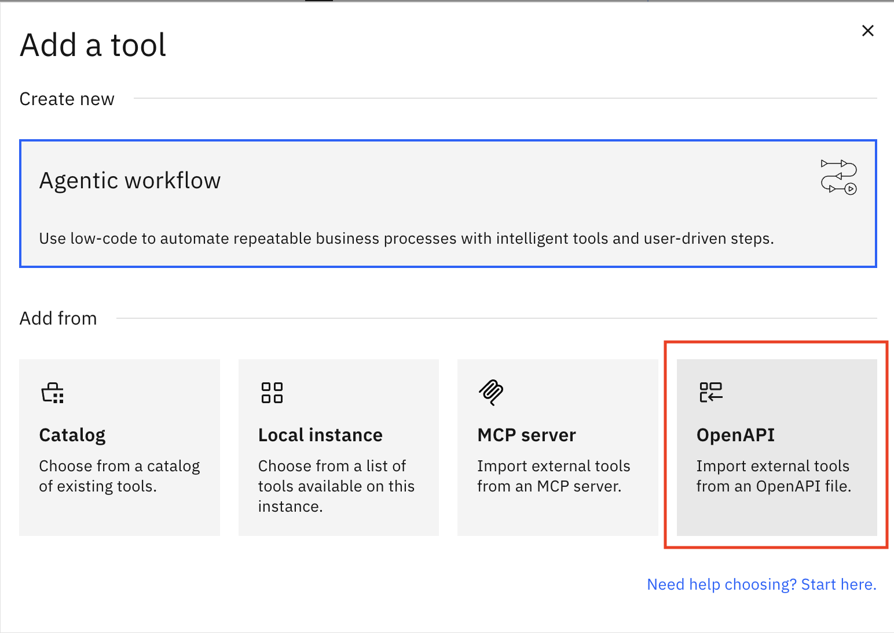
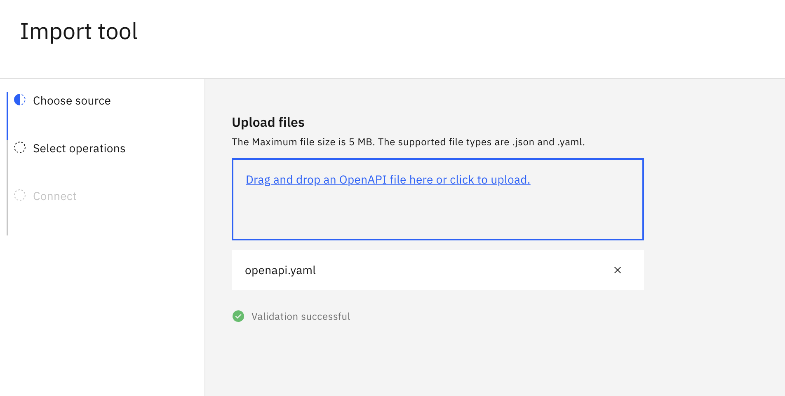
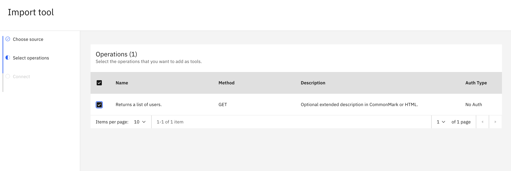
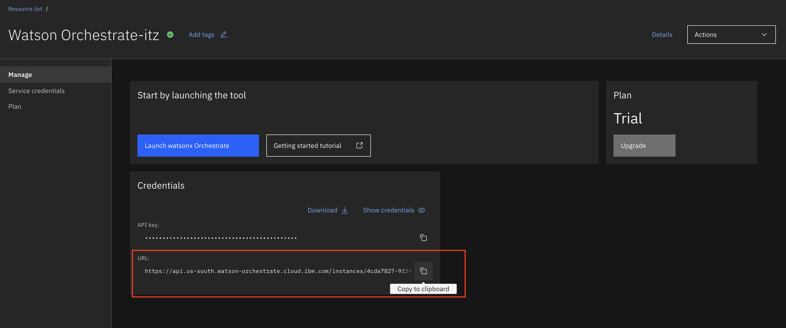
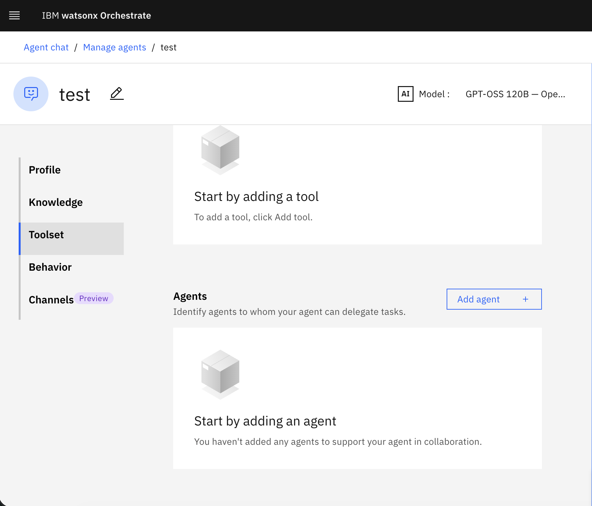
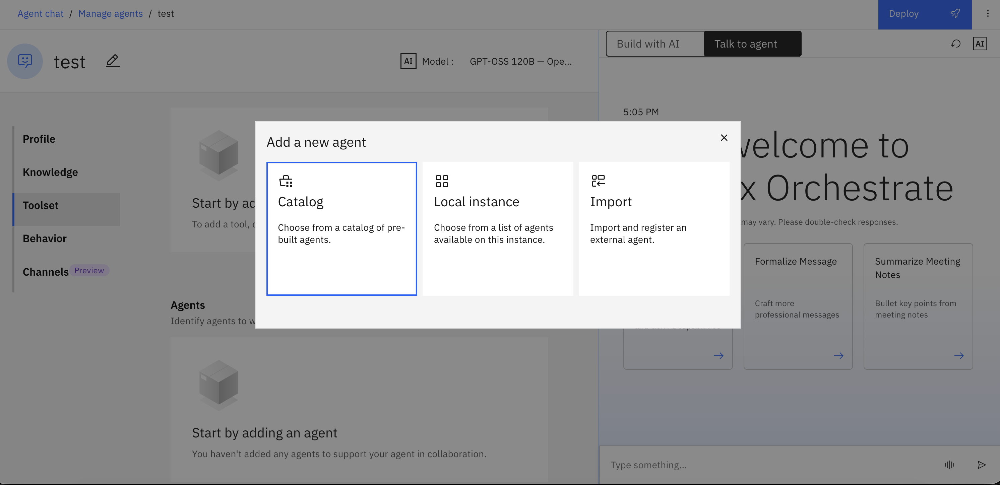
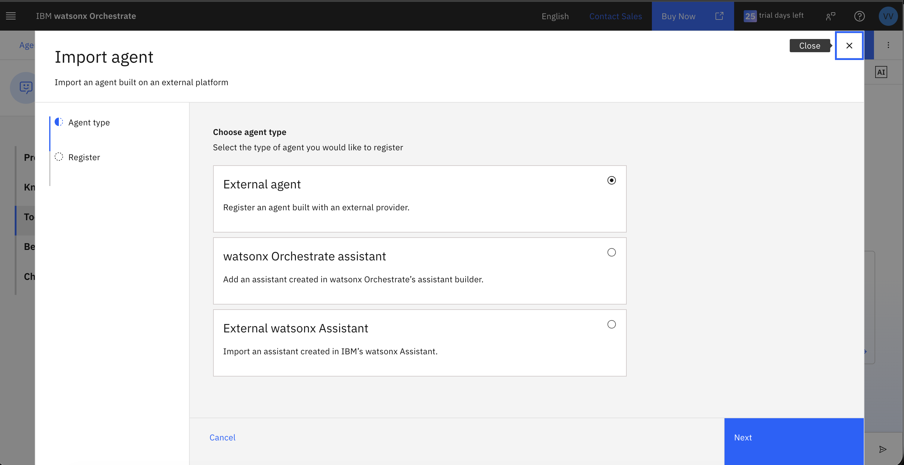

# Guida Avanzata di IBM Watsonx Orchestrate

## Agent tools
Un tool è codice deterministico per permettere al tuo agente di svolgere dei task. Dentro orchestrate puoi creare/importare diversi tipi di tool:
* [OpenAPI tool](#openapi) 
* [Python tool](#configurazione-delladk-e-uso-dei-python-tool)

Per creare un tool python serve utilizzare la Watsonx Orchestrate ADK. L’Agent Development Kit (ADK) è il toolkit ufficiale utilizzato per creare, personalizzare e distribuire agenti AI per IBM watsonx Orchestrate.


## OpenAPI
Per connettere un tool esterno, hai bisogno di una specifica OpenAPI che descriva l'API. La specifica deve essere in formato YAML/json. 


[Qui](tool/openapi.yaml) un esempio di openapi YAML

Per poter aggiungere un tool/openapi, cliccare sulla voce **Toolset>+Add Tool** e selezionare l'import di OpenAPI



Selezionare i metodi da importare



NOTA: Una volta aggiunto un tool al proprio agente, ricordati di istruire il tuo agente a descrivere come utilizzare il tool nelle descrizioni degli agenti **Beheviours** e **Guidelines**

## Configurazione dell'ADK e uso dei python tool


Segui queste istruzioni se prevedi di utilizzare l'ADK:

- Crea un file `.env` dal file `.env.example` nella directory base del repository.

- Per ottenere la tua chiave API di IBM Cloud:

  1. Accedi a IBM Cloud (cloud.ibm.com)
  2. Seleziona l'account corretto dove si trova watsonx Orchestrate nel menu a discesa nella barra superiore
  3. Vai su Manage > Access (IAM) nella barra superiore
  4. Vai su API keys nella barra laterale sinistra
  5. Crea una nuova chiave API con il pulsante blu `Create`, quindi scaricala o salvala
  6. Aggiungila nel file .env in `ORCHESTRATE_API_KEY` (specifico per watsonx.orchestrate).

- Richiede Python 3.11.
```python --version```

- Installa l’ultima versione di ibm-watsonx-orchestrate.
```pip install --upgrade ibm-watsonx-orchestrate```

- Attiva l' ambiente con la CLI dell’ADK utilizzando le varidabili di ambiente salvate nel `.env`.

Recupera l'**service-instance-url** dalla schermata di IBM Cloud relativa all'embiente Orchestrate


```
orchestrate env add -n <environment-name> -u <service-instance-url> --type ibm_iam

orchestrate env activate <env-name> --api-key <api-key>
```
orches
Per importa un tool python è possibile utilizzare il comando:
```bash


orchestrate tools import -k python -f ./tool/support_services.py
```

Più in generale, utilizza il seguente comando per importare il tuo tool personalizzato.
```bash
orchestrate tools import -k python -f <file-path> -r <requirements-path>
```

Per maggiori dettagli vedi [Documentazione Python tool](https://developer.watson-orchestrate.ibm.com/tools/create_tool).

## Pubblicare l'agent con ADK
Per pubblicare il tuo agent da ADK, lanciare il comando

```bash
orchestrate agents deploy --name agent_name
```

Puoi trovare un esempio di agente yaml nella directory [/agents/sample_agent.yaml](agent/sample_agent.yaml) in cui è possibile specificare da riga di comando:

* llm
* knowledge_base
* tools

Utilizza la [guida](https://developer.watson-orchestrate.ibm.com/agents/build_agent) ufficiale per poter configurare gli agenti correttamente

**NB**: se il tuo tool interagisce con un servizio esterno a Orchestrate utilizza le **Connection** per autenticarlo contro quel servizio in modo sicuro. Prima crea la connection da UI e poi associala al tuo tool (vedi [ApprofondimentoConnections](./ApprofondimentoConnections.md)).


## Estendi le capacità del tuo agente tramite altri agenti  

Crea una rete di agenti, il tuo agente può chiamare a sua volta altri agenti per estendere le sue funzionalità. Una volta aggiunti ulteriori agenti ricordati di specificare nel behaviour del tuo agente quando chiamarli.

Per aggiungere agenti, all'interno del tuo agente vai a Toolset > Agents > Add agent


clicca su new agent

potrai scegliere tra 3 diversi tipi di agenti: 
1. Da catalogo: agenti già creati da IBM o da terze parti, pronti ad essere utilizzati (o al più a cui va impostata una connection)
2. Da istanza locale: un agente precedentemente creato all'interno della tua istanza Watson.
3. agenti esterni, in questo caso si presentano tre opzioni: 


External agent: Aggiungi agenti da piattaforme di terze parti come Langflow o altri Agenti esterni.

IBM watsonx Orchestrate assistant (gli assistenti sono versioni precedenti e deterministiche degli agenti):
aggiungi un assistant pubblicato da IBM watsonx Orchestrate.

External watsonx Assistant: aggiungi un assistente publicato da IBM watsonx Assistant o da AI assistant builder.

