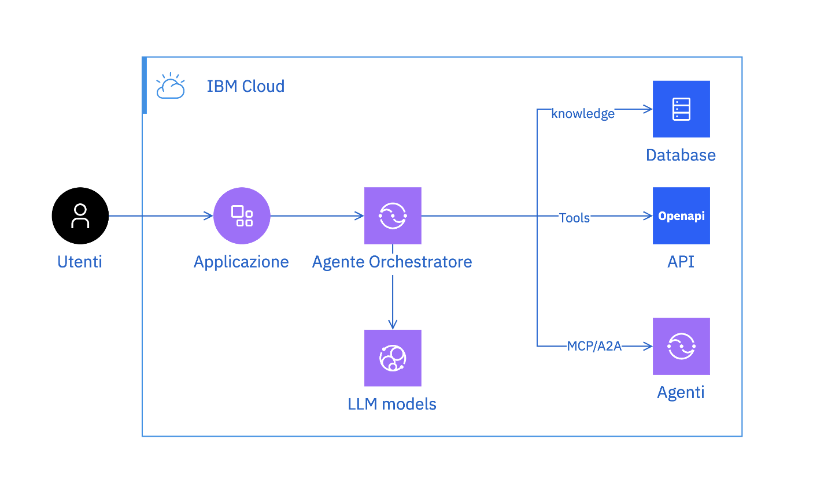
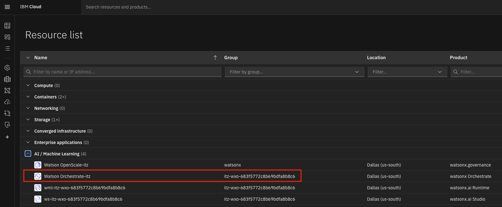
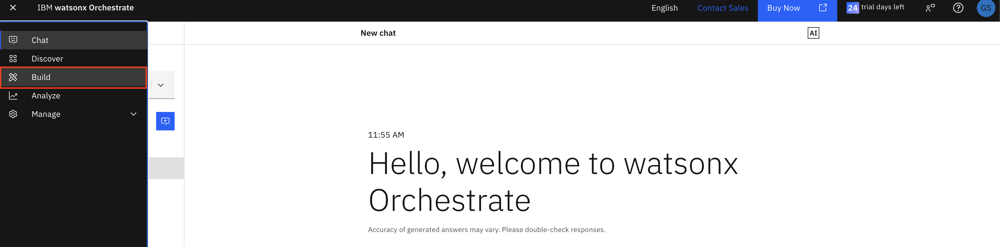
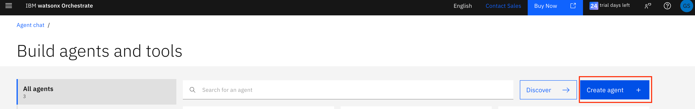
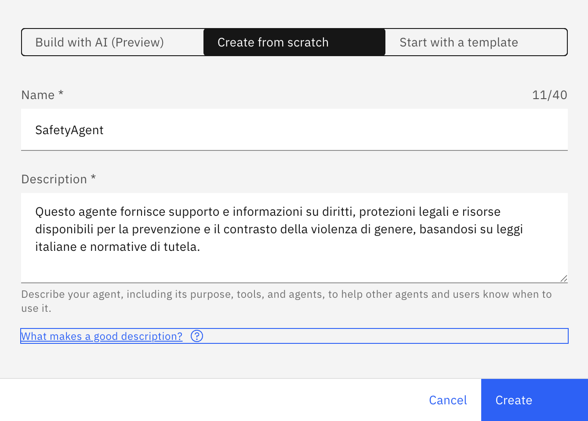
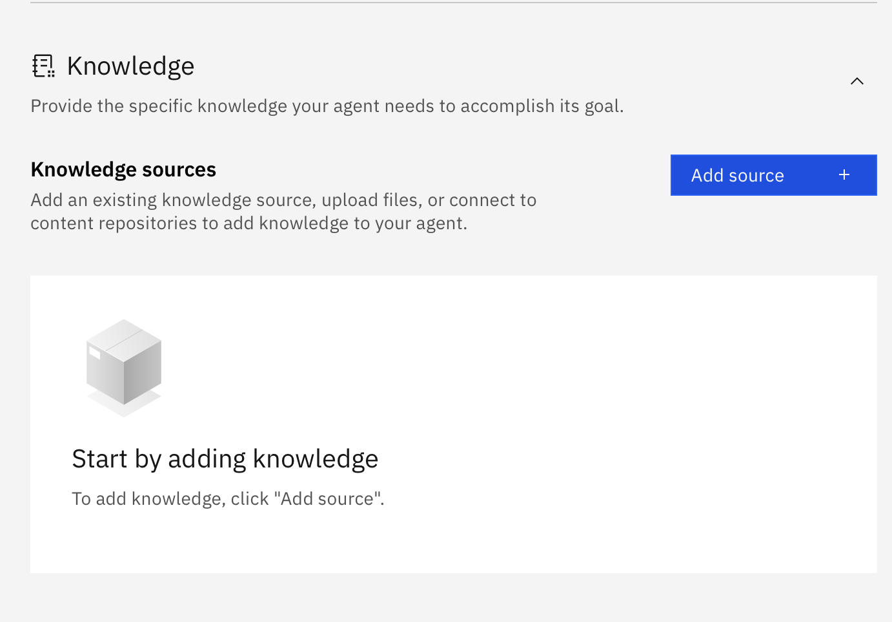
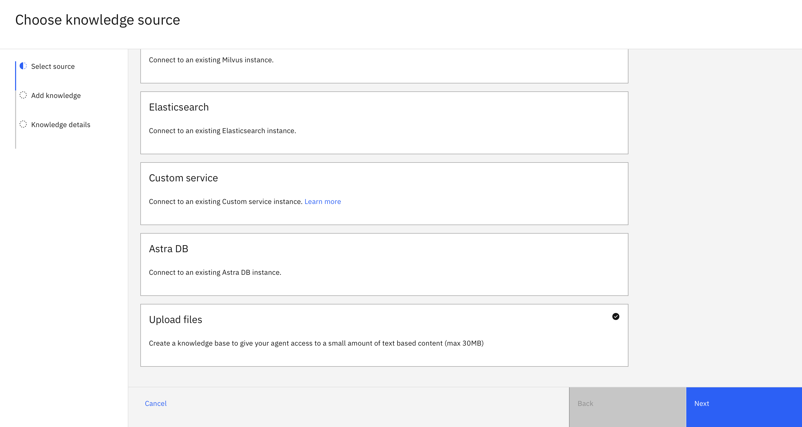
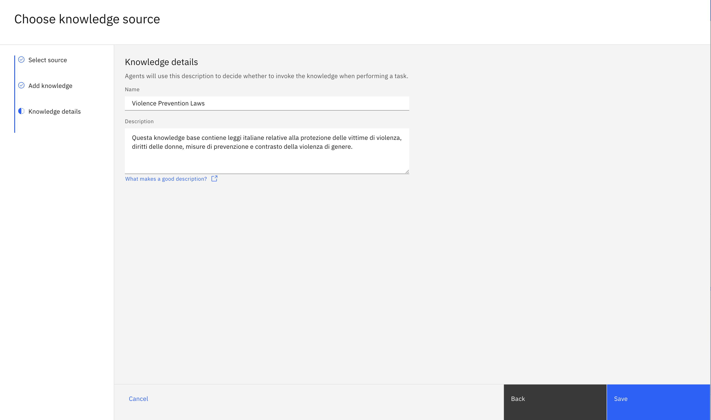
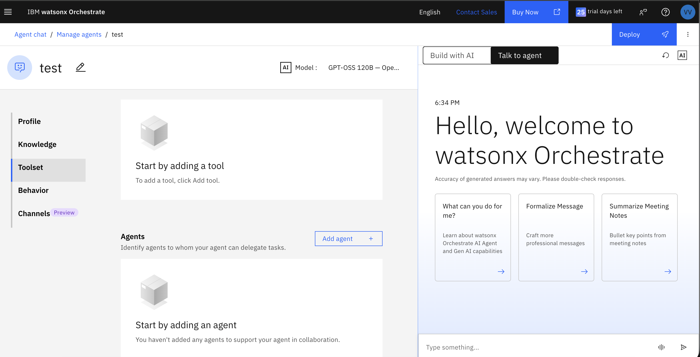
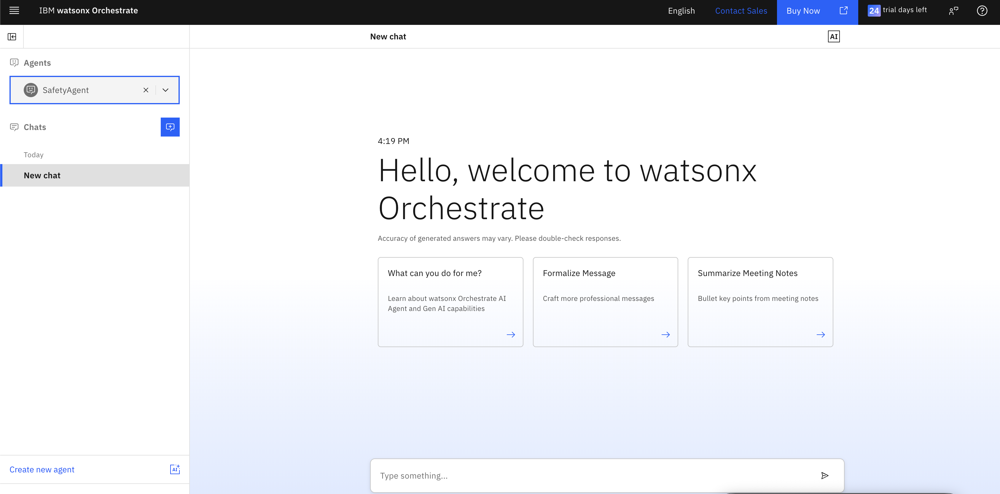

# Guida base per la creazione di un agente AI con watsonx Orchestrate

IBM watsonx Orchestrate è uno strumento che permette di creare agenti Ai in grado di dialogare
con gli utenti in linguaggio naturale.

Ogni ambiente orchestratore è composto da un agente orchestratore in grado di richiamare:
* una base di conoscenza (knowledge base)
* ulteriori agenti di secondo livello
* tools e strumenti esterni


In questa guida è illustrato come creare un sistema di agenti AI utilizzando watsonx Orchestrate:
- [Creare un agente da zero](#passo-1-crea-il-tuo-primo-agente)
- [Configurare il comportamento dell'agente](#passo-2-configura-il-comportamento-dellagente)
- [Aggiungere una knowledge base con documenti](#passo-3-aggiungi-una-knowledge-base)

Per utilizzare IBM watsonx Orchestrate in modalità avanzata, seguire questa guida

[>>> GUIDA AVANZATA ORCHESTRATE](OrchestrateAdvanced.md)


## Prerequisiti
Per poter utilizzare IBM Orchstrate con cui creare i tuo agenti AI è necessario:
* Aver creato un proprio IBM-id
* Aver ottenuto dai tutor IBM accesso ad un ambiente IBM Orchestrate
* (Opzionale) Per poter utilizzare tool python ed accedere alle funzionalità avanzate:
  * Installare Python 3.11+ sul proprio pc
  * Installare la CLI IBM Orchestrate


### Passo 1: Crea il tuo primo agente

- Naviga nel menu hamburger in alto a sinistra, quindi su Resource List. Apri la sezione AI/Machine Learning. Dovresti vedere un servizio **watsonx Orchestrate**, clicca per aprirlo.



- Clicca sul pulsante "Launch watsonx Orchestrate".


- Benvenuto in watsonx Orchestrate! Apri il menu hamburger, clicca sulla freccia verso il basso accanto a **Build**.




- Clicca su **Create agent +**



- Seleziona **Create from scratch**, dai un nome al tuo agente, ad esempio `SafetyAgent`, e compila la **Description**:

```markdown
Questo agente fornisce supporto e informazioni su diritti, protezioni legali e risorse disponibili per la prevenzione e il contrasto della violenza di genere, basandosi su leggi italiane e normative di tutela.
```

Quindi clicca su **Create**.



### Passo 2: Configura il comportamento dell'agente

- Cerca le impostazioni **Behavior** in basso e fornisci le istruzioni all'agente. Queste istruzioni definiscono come l'agente interagisce con gli utenti:

```markdown
Sei un assistente specializzato nel supporto contro la violenza di genere.
Sei empatico, rispettoso e fornisci informazioni chiare e utili.
Conosci le leggi italiane relative alla protezione delle vittime di violenza.
Rispondi all'utente in modo sensibile, comprensivo e non giudicante.
Fornisci informazioni su diritti legali, misure di protezione e risorse disponibili.
Rispondi sempre nella stessa lingua dell'utente.
In caso di emergenza, ricorda sempre di suggerire di contattare il 1522 (numero antiviolenza) o il 112.
```

> **Nota**: Questo è un esempio specifico per il supporto contro la violenza. Puoi adattare queste istruzioni al tuo caso d'uso specifico.

### Passo 3: Aggiungi una knowledge base

Per poter 
- Nella sezione **Knowledge > Knowledge sources** clicca sul pulsante **Add source**.



- Seleziona **New knowledge** e poi scorri verso il basso fino all'opzione **Upload files**. Clicca sul pulsante **Next**.



- Carica i file e clicca sul pulsante **Next**.

- Dai un nome alla knowledge base, ad esempio `Violence Prevention Laws`, e una descrizione:

```markdown
Questa knowledge base contiene leggi italiane relative alla protezione delle vittime di violenza, diritti delle donne, misure di prevenzione e contrasto della violenza di genere.
```



### Passo 4: Testa il tuo agente

Ora testa l'agente nella chat a destra. Prova domande come:
- `Quali sono i miei diritti se subisco violenza domestica?`
- `Come posso ottenere un ordine di protezione?`
- `Quali misure di tutela esistono per le vittime di violenza?`

> **Suggerimento**: Questi sono esempi specifici per il caso d'uso della violenza. Adatta le domande al tuo scenario specifico.


### Passo 5: Pubblica il tuo agente 
Deployiare un agente significa portatlo da uno stato di draft a uno stato live dove può essere utilizzato anche esternamente.

Da UI all'interno dell'agente, in alto a destra è possibile cliccare sul tasto **deploy** per pubblicare il tuo agente. 


Accedi alla chat di orchestrate per poter utilizzare il tuo agente orchstratore

